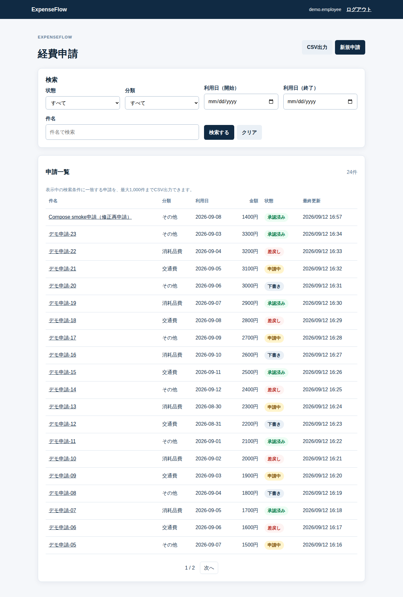
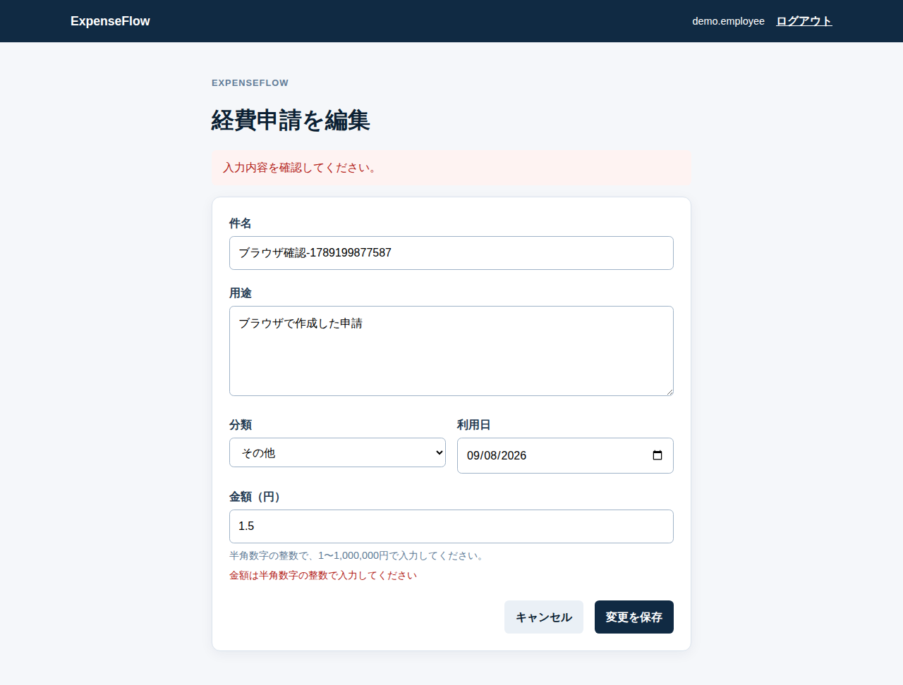
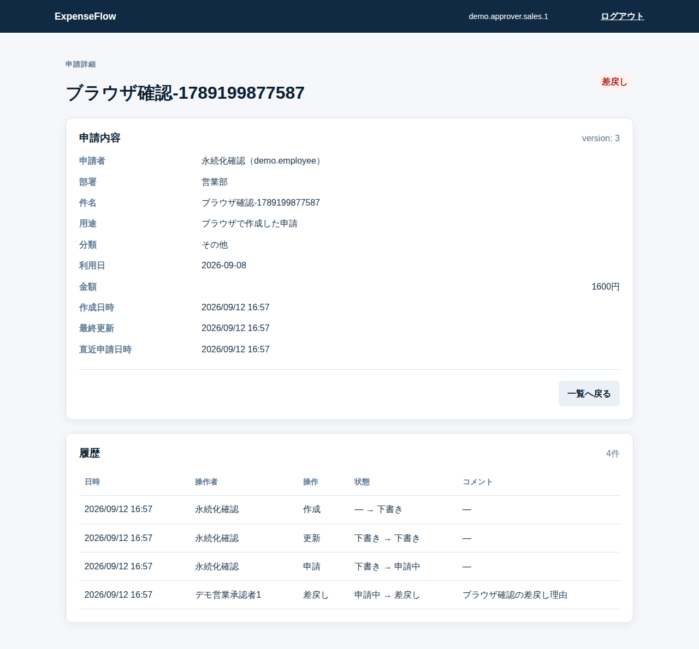
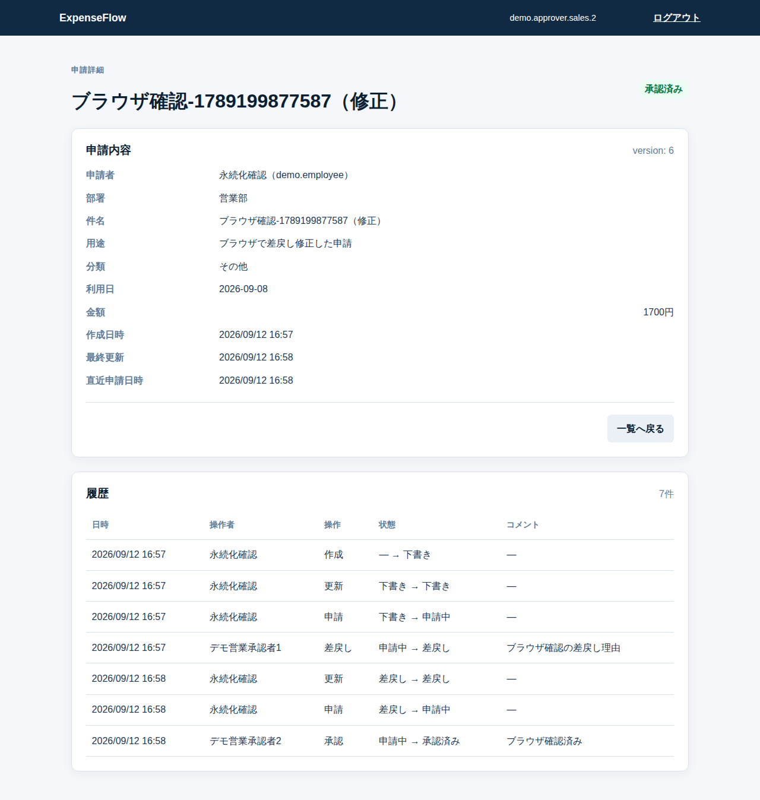

# ExpenseFlow

Java / Spring Bootで作る、架空企業向けの経費申請・承認システムです。業務ルール、認可、DB永続化、異常系テストを説明できるポートフォリオを目的とします。実在企業の業務や法令要件を再現するものではありません。

[](https://github.com/unitier0214/expense-flow/actions/workflows/ci.yml)
[テスト結果](docs/test-results.md) / [設計](docs/design.md) / [3分デモ](docs/demo-script.md)

本人・部署・状態をServiceで検証し、承認時の競合を楽観ロックで拒否します。経費の変更と履歴を同一トランザクションに保存し、実PostgreSQLの並行更新・履歴保存失敗もテストしています。基本機能の完成後に、検索条件を再利用するCSV出力を追加機能として実装しました。

## 実装範囲（フェーズ5まで）

- Java 21、Spring Boot 4.1.1、Spring MVC、Thymeleaf
- PostgreSQL 17、Spring Data JPA、Flyway
- Spring Securityのフォームログイン、BCrypt、CSRF保護、POSTログアウト
- 全テーブルの初回Flywayマイグレーション
- demoプロファイル限定の架空ユーザー・部署・申請45件・履歴
- Docker ComposeのDB readiness、アプリhealthcheck、DB永続化
- 本人の経費申請一覧（状態・分類・利用日期間・件名検索、20件ページング）
- 下書きの作成・編集・削除、申請・再申請、申請詳細・履歴表示
- DRAFT / RETURNEDの編集、DRAFTのみ削除、本人だけの変更操作
- 同部署APPROVERによるDRAFT以外の詳細・履歴閲覧
- 承認待ち一覧（本人以外・同部署・SUBMITTED、20件ページング）
- 承認待ち一覧の状態ラベル、申請詳細の状態・履歴・承認／差戻しフォーム
- 同部署の別APPROVERによる承認・理由付き差戻し、RETURNEDからの本人再申請
- PostgreSQL側の絞り込み・ページング、CSRF、楽観ロック、トランザクション内の履歴保存
- 本人一覧と同じ条件で出力するCSV（UTF-8 BOM、JST表示、1,000件上限、RFC 4180相当の引用・数式対策）

CSVは本人の検索条件を引き継ぎ、`updated_at DESC, id DESC`で全該当行を出力します。1,001件以上は黙って切り捨てず、条件追加を案内する400になります。下書き削除時に履歴も削除する設計であり、完全な監査台帳ではありません。

demoプロファイルの45件は、変更可能な件名ではなくV2で追加した永続seed marker（`expense-01`〜`expense-45`）で投入済み判定を行います。件名変更・同名申請・seed下書き削除後の再起動でも、既存データを復活・増殖させません。V1は変更せず、既存DBの正規件名はV2適用時に一度だけmarkerへ移行します。

## 実際のデモ画面

Chromiumでアプリを操作して取得した画面です。画像を開くと拡大できます。

| 本人の申請一覧 | 編集時の入力エラー |
|---|---|
|  |  |
| 差戻し理由と履歴 | 承認済みの状態と履歴 |
|  |  |

[375px幅の一覧](docs/images/mobile-list.png) / [画像の取得元と確認範囲](docs/images/README.md)

## 起動手順

### Docker Composeでデモを試す（推奨）

Docker EngineとCompose v2（Docker Desktopでも可）が必要です。リポジトリを取得し、そのディレクトリで以下を実行します。

1. POSIXシェルでは `cp .env.example .env`、PowerShellでは `Copy-Item .env.example .env` で設定ファイルを作成します。既にある場合は上書きせず内容を確認します。
2. `.env` をエディターで開き、初回DB作成用の `POSTGRES_PASSWORD` を設定します。同じファイルに `SPRING_PROFILES_ACTIVE=demo` を1行追加します。
3. `docker compose up -d --build --wait` を実行します。
4. [http://localhost:8080/login](http://localhost:8080/login) を開き、下記の社員アカウントでログインします。

この手順はPOSIXシェル・PowerShell共通です。`APP_PORT`を変更した場合はURLのポートも変更します。標準構成ではアプリを127.0.0.1に限定し、DBポートをホストに公開しません。

デモ用ログイン情報（demoプロファイルのみ。架空の公開fixtureであり、本番の秘密情報ではありません）：

- 社員：`demo.employee` / `demo-password`
- 営業部承認者1：`demo.approver.sales.1` / `demo-password`
- 営業部承認者2：`demo.approver.sales.2` / `demo-password`
- 開発部社員：`demo.employee.dev` / `demo-password`
- 開発部承認者：`demo.approver.dev` / `demo-password`

パスワードはログへ出力しません。実運用の認証情報として使用しないでください。

DBデータは `postgres-data` ボリュームに保持されます。DBを破棄する操作はこのREADMEの通常起動手順には含めません。

停止は `docker compose down`、再開は `docker compose up -d --wait` です。既存ボリュームのDBパスワードは `.env` の書換えだけでは変わらないため、初回作成時の値を使用します。通常プロファイルを使う場合は `.env` の `SPRING_PROFILES_ACTIVE` を `default` に変更します。通常プロファイルはユーザーを自動作成せず、既存のデモユーザーも削除しません。

### Maven Wrapperで開発する

Java 21とDocker Compose v2を用意します。上記と同様に `.env` を作成・設定してから、任意のDB公開設定を追加してDBだけ起動します。

```text
docker compose -f compose.yaml -f compose.maven.yaml up -d --wait db
```

DBは `127.0.0.1:${DB_PORT:-5432}` のみに公開されます。既に5432を使用中なら `.env` の `DB_PORT` を空いているポートへ変更します。Mavenで起動するアプリは8081を使うため、通常Composeの8080とは競合しません。

Spring BootはCompose用の `.env` を自動読込みしません。次の `POSTGRES_DB`、`POSTGRES_USER`、`POSTGRES_PASSWORD`、`DB_PORT` に相当する値を、実際の `.env` と一致させて設定します。

POSIXシェル：

```bash
export SPRING_DATASOURCE_URL='jdbc:postgresql://localhost:5432/expenseflow'
export SPRING_DATASOURCE_USERNAME='expenseflow'
export SPRING_DATASOURCE_PASSWORD='ここを.envのPOSTGRES_PASSWORDと同じ値に変更'
export SPRING_PROFILES_ACTIVE=demo
export SERVER_PORT=8081
./mvnw spring-boot:run
```

PowerShell：

```powershell
$env:SPRING_DATASOURCE_URL = 'jdbc:postgresql://localhost:5432/expenseflow'
$env:SPRING_DATASOURCE_USERNAME = 'expenseflow'
$env:SPRING_DATASOURCE_PASSWORD = 'ここを.envのPOSTGRES_PASSWORDと同じ値に変更'
$env:SPRING_PROFILES_ACTIVE = 'demo'
$env:SERVER_PORT = '8081'
.\mvnw.cmd spring-boot:run
```

[http://localhost:8081/login](http://localhost:8081/login) で確認します。アプリ停止はCtrl+C、DB停止は `docker compose -f compose.yaml -f compose.maven.yaml down` です。CIではUbuntuのPOSIX手順を実行し、DB起動・Flyway・health UP・ログイン画面200を確認します。PowerShellでの実行確認は未実施です。

## テスト

```bash
./mvnw test
./mvnw verify
```

認証、未認証アクセス、CSRF拒否、Flyway適用、申請の作成・編集・申請、承認・差戻し、権限・検索・競合・履歴ロールバックをTestcontainersのPostgreSQLで検証します。Dockerが起動していない環境ではTestcontainersテストは実行できません。

GitHub Actionsの`dependency-scan` jobでは、`./mvnw --batch-mode -DskipTests package`でSpring Bootの実行jarを生成し、CycloneDX Maven Plugin 2.9.1でcompile/runtime（推移的依存を含む）のSBOMを作成します。Trivy 0.58.2は`target/bom.json`をSBOMとして解析し、生成jarの`BOOT-INF/lib`一覧、依存ツリー、SBOMに含まれるパッケージ名・バージョンをartifactへ保存します。解析対象の欠落・空の依存一覧・脆弱性検出はCIを成功扱いにしません。アプリ依存の無関係な一括アップグレードは行いません。

## 3分デモ

1. 上記のComposeデモ起動手順を実行し、`demo.employee` でログインする。
2. 新規申請を作成し、編集画面で小数金額を送信して入力エラーを確認する。元の編集先を保ったまま整数へ直して保存し、申請する。
3. `demo.approver.sales.1` へ切り替え、「承認待ち」から対象を開いて理由付き差戻しを行う。
4. `demo.employee` で理由を履歴から確認し、修正・再申請する。
5. `demo.approver.sales.2` で同じ申請を承認し、詳細の状態・履歴を確認する。
6. ログアウトして `demo.employee` へ再ログインする。一覧へ戻り、必要なら検索条件を設定して「CSV出力」を押す。UTF-8 BOM、日本語列、JST日時、検索条件の引き継ぎを確認する。
7. POSTログアウト後に保護URLへアクセスしてログインが必要なことを確認する。

詳細は [デモ手順](docs/demo-script.md) を参照してください。demoのパスワードは公開用の架空fixtureであり、実環境の秘密情報ではありません。

## 構成資料

- [設計書](docs/design.md)
- [判断記録](docs/decisions.md)
- [進捗](docs/progress.md)
- [テストケース](docs/test-cases.md)
- [テスト結果](docs/test-results.md)
- [デモ手順](docs/demo-script.md)
- [ブラウザ用の公開環境案](docs/browser-demo-hosting.md)
- [学習ガイド](docs/learning-guide.md)
- [フェーズ4現状報告](docs/Astra_expense-flow_status_phase4_2026-09-09.md)
- [最終引き継ぎ資料](docs/Astra_expense-flow_status_final_2026-09-09.md)

## AI支援について

設計・レビューに加え、コードの実装、テスト作成・実行、資料作成にもAI支援を使用しています。実務経験や本人の理解度をこのリポジトリの存在だけで示すものではありません。応募・説明前に [学習ガイド](docs/learning-guide.md) の観点を本人が確認してください。
