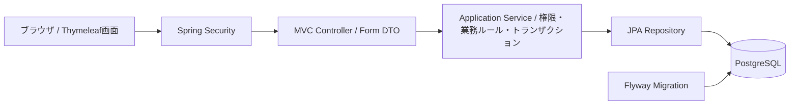
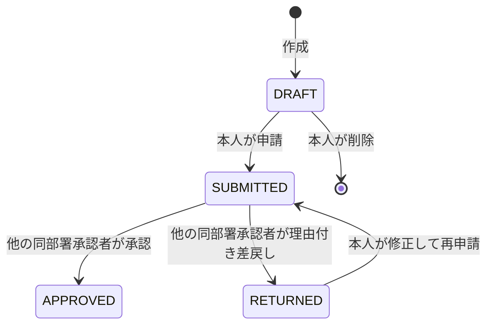

# ExpenseFlow：経費申請・承認システム 設計書

## 1. 案件への合わせ方

確認日：2026-09-09。募集元：https://crowdworks.jp/public/jobs/13435257。募集にはJava、Spring Boot（未経験可）、業務系Webアプリの開発・機能追加・テスト・保守、経験に応じた詳細設計が記載されている。具体的な業界、DB、画面技術、実際の業務要件は未記載。本設計の経費業務と技術選定はポートフォリオ向けの提案であり、募集元の指定ではない。

狙いは「仕様を理解してJavaで実装し、異常系もテストできる」ことを第三者が短時間で確かめられる成果物。GitHub、起動手順、業務フローのデモ、テスト仕様・実行結果を揃える。採用の保証や実務経験の代替とはしない。

## 2. スコープ

架空企業の社員が経費を申請し、同じ部署の承認者が承認・差戻しを行う。1申請＝1経費、円建て、単段階承認。想定は数十人・数千件の学習用データ。性能値は未測定の設計目標として扱う。

必須：ログイン、本人の申請一覧・検索・ページング、作成・編集・下書き削除、申請、承認待ち一覧、承認・差戻し、履歴表示、競合検知、意味のある自動テスト、Docker起動、説明資料。

追加：検索条件と同じ範囲のCSV出力。必須完了後に実装し、機能追加の差分とテストを残す。

今回含めない：領収書アップロード、OCR、メール、銀行振込、税務処理、複数段階承認、ユーザー管理画面、SPA、外部API、マイクロサービス。本アプリのルールは架空企業の簡略化した社内ルールで、法令要件の再現ではない。

## 3. 技術・構成

| 項目 | 選定と理由 |
|---|---|
| 言語 | Java 21。Javaの業務ロジックを読みやすく示す |
| Web | Spring Boot 4.1.1を候補とし、実装時に公式情報・依存整合性を確認して固定 |
| 画面 | Spring MVC + Thymeleaf + ローカルCSS。フォーム送信型でJavaに集中 |
| 認証 | Spring Security、フォームログイン、セッション、BCrypt |
| DB | PostgreSQL 17、Spring Data JPA、Flyway。テストもPostgreSQL |
| ビルド | Maven Wrapper。依存バージョンはBootの管理に寄せる |
| テスト | JUnit、MockMvc、Testcontainers。Bootに適合する構成を選ぶ |
| 実行 | Docker ComposeでアプリとDB。CIはGitHub Actions用設定を作成 |

公式システム要件ではSpring Boot 4.1.1はJava 17〜26に対応している。実装時に確認結果をdocs/decisions.mdへ残し、黙って別世代へ変更しない。
https://docs.spring.io/spring-boot/system-requirements.html

CSRF保護を維持する。公式リファレンス：
https://docs.spring.io/spring-security/reference/servlet/exploits/csrf.html

feature単位（auth / expense / approval / shared）にまとめ、各機能の内部をweb / service / repository / domainで分ける。Controllerは入力と画面制御、Serviceは権限・状態・更新、Repositoryは検索・永続化を担当。Entityをフォームへ直接バインドしない。汎用基底クラスや独自フレームワークは不要。

## 4. 権限

単一企業。ユーザーの部署・権限は固定データとし、画面から変更しない。

| 操作 | EMPLOYEE | APPROVER |
|---|---|---|
| 自分の申請作成・一覧・詳細 | 可 | 可 |
| 自分の編集・削除・申請 | 下記状態ルールによる | 同左 |
| 他人の申請詳細・履歴 | 不可 | 同部署かつDRAFT以外のみ可 |
| 承認待ち一覧 | 不可 | 同部署・自分以外・SUBMITTEDのみ |
| 承認・差戻し | 不可 | 同部署・自分以外・SUBMITTEDのみ |

URL、POSTのID、検索条件を書き換えてもServiceと検索クエリで強制する。閲覧できないIDは存在しない場合と同じ404。権限のない承認画面・操作は403。画面のボタン非表示だけに依存しない。承認者自身の申請も自己承認できず、別の同部署承認者が処理する。

## 5. 状態遷移・業務ルール

- DRAFT / RETURNEDだけ本人が編集できる。編集では状態を変えない。削除はDRAFTだけ。
- APPROVEDは終端。取消し・承認解除・申請取下げは対象外。
- 件名：Unicode空白を`String.strip()`で除去した後の1〜100文字。用途：同じく`strip()`後の1〜500文字。全角スペース（U+3000）だけの入力も空文字として400にする。分類：TRANSPORT / SUPPLIES / OTHERの固定値。
- 利用日：必須、Asia/Tokyoでの当日以前。Clockを注入してテストを固定可能にする。
- 金額：画面から受け取った文字列を`String.strip()`し、半角数字のみ（正規表現`[0-9]+`）であることを確認してからJava BigDecimalへ変換する。値は1〜1,000,000円の整数に限り、小数表記（`1.5`、`1.0`）、指数表記（`1e3`）、カンマ、非数値、範囲外を400で拒否する。400のフォーム再表示では元の入力文字列を保持する。Java BigDecimal、DB NUMERIC(12,0)。DBの丸めに頼らず、サービス層とドメインでも整数値・範囲を検証する。
- 差戻し理由：`String.strip()`後1〜500文字、差戻し時必須。全角スペースだけの理由も400にする。承認コメントは任意で500文字以内で、保存時は同じ空白規則で正規化する。
- 下書き保存にも上記経費項目の入力要件を適用する（未入力の一時保存は対象外）。
- 作成者・部署・状態・承認者・合計・日時はサーバーが決める。クライアント入力を信用しない。
- 編集・削除・申請・承認・差戻しにはversionを必須送信し、DBの@Versionと比較。古い画面や並行更新は409で再読込案内、上書きしない。
- JPAの楽観ロックを実際のflush/commitまで確認。状態更新と履歴追加は同一トランザクションで、失敗時は双方ロールバック。
- 二重申請・二重承認で状態や履歴を重複させない。最新versionでも不正な遷移は409。

## 6. データモデル

共通日時はtimestamptz / Instantで保存、表示はAsia/Tokyo。IDはDB生成のbigint。

| テーブル | 主なカラム・制約 |
|---|---|
| departments | id PK, name NOT NULL UNIQUE |
| users | id PK, department_id FK NOT NULL, username UNIQUE NOT NULL, display_name, password_hash, role CHECK(EMPLOYEE/APPROVER), enabled |
| expense_requests | id PK, applicant_id FK NOT NULL, department_id FK NOT NULL, title varchar(100), purpose varchar(500), category varchar(30), expense_date date, amount numeric(12,0), status varchar(20), version bigint NOT NULL, created_at, updated_at, submitted_at nullable |
| expense_events | id PK, expense_id FK ON DELETE CASCADE, actor_id FK NOT NULL, action, from_status nullable, to_status, comment varchar(500) nullable, occurred_at |
| demo_seed_entries | seed_key PK, expense_id nullable, created_at。V2で追加するdemo専用の投入済みマーカー。expense_requestsへのFKは持たせず、件名変更や下書き削除後もseed_keyを残す |

expense_requestsの必須項目にNOT NULL、金額にCHECK、状態・分類にCHECK。department_idは作成時に本人部署から設定するスナップショット。イベントはCREATE / UPDATE / SUBMIT / APPROVE / RETURNで追記のみ、UPDATEは変更事実を記録し全項目の旧値比較は対象外。再申請もSUBMIT、submitted_atは直近の申請日時に更新。下書き削除は履歴も削除するため、完全な監査台帳ではないことをREADMEに明記する。

索引：expense_requests(applicant_id, updated_at, id)、expense_requests(department_id, status, submitted_at, id)、expense_events(expense_id, occurred_at, id)。利用者名表示でN+1を起こさない取得方法にする。

## 7. 画面・HTTP契約

| メソッド・パス | 内容 |
|---|---|
| GET /login, POST /login, POST /logout | Securityによる認証・ログアウト |
| GET / | 自分の申請一覧へリダイレクト |
| GET /expenses | 自分の一覧。status/category/from/to/q/pageで検索 |
| GET /expenses/new | 新規フォーム |
| POST /expenses | 下書き作成 |
| GET /expenses/{id} | 権限のある詳細と履歴 |
| GET /expenses/{id}/edit | 編集フォーム |
| POST /expenses/{id}/edit | versionを指定して更新 |
| POST /expenses/{id}/delete | versionを指定して下書き削除 |
| POST /expenses/{id}/submit | versionを指定して申請・再申請 |
| GET /approvals | 承認待ち。同部署・本人以外・SUBMITTEDに固定 |
| POST /expenses/{id}/approve | version、任意comment |
| POST /expenses/{id}/return | version、必須comment |
| GET /expenses/export.csv | 追加機能。本人一覧と同じフィルター、全該当行 |

一覧は20件/ページ、updated_at DESC, id DESC。承認待ちはsubmitted_at ASC, id ASC。from/toは利用日の両端を含む。qは件名の部分一致、最大100文字。検索の%/_を通常文字として扱う。利用日from > to、不正enum、負のpageは400、検索結果が0件・範囲外pageは空状態表示。検索条件をページ移動時に保持。

経費申請の正常POSTはPRGで303。Spring Securityが処理するログイン・ログアウトの302は現状どおり維持する。入力エラーは400でフォーム値・項目別日本語メッセージを保持。未認証はログインへ、CSRFエラーは403、閲覧不可/不存在は404、競合/不正遷移は409。500は汎用エラー画面とログの照合ID、スタックトレースを画面へ出さない。

画面は白背景、濃紺のナビ、読みやすい日本語、表の金額を右寄せ。状態は色＋日本語ラベル。ページ名、主要操作、検索、結果件数、テーブル、ページングの順。詳細には申請内容、許可された操作、時系列履歴。入力ラベルとエラーを紐付け、キーボードで操作可能にする。空状態・競合画面も完成させる。グラフや飾りのダッシュボードは不要。

## 8. テストと受入基準

| ID | 検証する振る舞い |
|---|---|
| T01 | 正常・不正ログイン、未認証アクセス、POSTでのCSRF拒否 |
| T02 | 件名・用途・理由の空白と上限境界、金額0/1/1000000/1000001/小数、未来日 |
| T03 | 本人が下書き作成→編集→申請でき、DBに状態・履歴が残る |
| T04 | 同部署の別承認者が承認でき、承認済みを編集・再承認できない |
| T05 | 理由なし差戻しは失敗、理由付き差戻し→修正→再申請が成功 |
| T06 | 社員による承認、自己承認、他部署の閲覧/承認、他人の下書き閲覧を拒否 |
| T07 | URL/POST ID改変、applicant_id/status等の余計なパラメータで権限・状態を変更できない |
| T08 | 古いversionの編集・削除・承認を拒否、別トランザクションの同時承認は1件だけ成功し履歴も1件 |
| T09 | 履歴保存を失敗させる結合テストで状態更新もロールバックする |
| T10 | 自分のデータだけを検索・ページングでき、条件保持・0件・不正検索入力を確認 |
| T11 | 入力文字列のHTMLが実行されずエスケープ表示される |
| T12 | 新規DBへのFlyway適用、再起動後のデータ保持、README手順での起動 |
| T13 | CSV追加時：権限・絞り込み・日本語・引用符/改行・数式対策・出力上限 |

純粋な業務ルールは単体テスト。認証とHTTPはMockMvc。DB制約、検索、楽観ロック、トランザクションはTestcontainersの実PostgreSQL。Repositoryをすべてモックして結合テスト扱いにしない。テスト件数やカバレッジの数字を目標にせず、上記仕様との対応表を作る。

## 9. デモ・運用・成果物

demoプロファイル限定で架空データを冪等投入：営業部に社員1名・承認者2名、開発部に社員1名・承認者1名、状態を分散した申請45件。ページング・差戻し・部署制限を再現可能にする。投入済み判定は変更可能な件名ではなく、V2の`demo_seed_entries`に`expense-01`〜`expense-45`を記録する。既存DBへのV2適用時は、旧実装の正規件名に一致する行を各seedへ一度だけバックフィルする。旧実装時点ですでに改名・削除された申請には履歴上のseed識別子がないため、V2で完全に推測することはできない。この限界は資料へ明記する。デモ認証情報はdemo限定。通常プロファイルに固定ユーザーを生成しない。パスワード等をログに出さない。

まずローカルでdocker compose up --buildにより起動。公開デプロイは別作業とし、共有アカウント・データ分離・リセット・レート制限・HTTPSを設計してから行う。DBポートは必要時だけlocalhostへ公開。アプリhealthcheck、DB readiness、DB永続ボリュームを用意。DB破棄は明示的な手順に分離する。

必須成果物：ソースコード、README、.env.example、Compose、Maven Wrapper、Flyway SQL、docs/design.md、docs/decisions.md、docs/test-cases.md、docs/test-results.md、docs/demo-script.md、docs/learning-guide.md、実画面スクリーンショット、CI設定。テスト結果には実行日・コマンド・結果・未実行理由を記録する。

3分デモ：社員で申請作成→入力エラー訂正→申請→同部署承認者へ切替→理由付き差戻し→社員が修正・再申請→別ユーザーが承認→履歴確認。権限拒否・競合はテストまたは別の短い操作で示す。

機能追加の見せ方：必須完成後、CSV出力を実際の追加変更として実装し、変更理由・変更箇所・回帰テストを記録する。過去の障害対応やチーム開発歴を創作しない。

CSV仕様：UTF-8 BOM付き、列はID/件名/分類/利用日/金額/状態/更新日時。検索と同じ認可付きクエリを共有しページングのみ外す。上限1000件、超過は400で絞り込み案内。RFC 4180相当の引用符・改行処理。文字列セルは先頭空白を除いて=,+,-,@または制御文字で始まる場合にアポストロフィを前置し表計算ソフトの数式評価を避ける。金額はサーバー検証済み整数。Content-Dispositionは固定ファイル名。

## 10. 説明できるようにする項目

なぜServiceに権限と業務ルールを置くか、DTOとEntityの違い、@Transactionalと@Versionの役割、SQLの絞り込みと索引、CSRFとログインの違い、二重承認をどう防ぐか、テストをどの層に置いたか。AI支援を受けた箇所と、自分が理解・検証した範囲を分けて説明する。

構成のトレードオフ：SSRはフロントエンドの独立性を抑えるがJava中心の開発を説明しやすい。JPAは定型SQLを減らすがSQL理解の証拠として検索SQL・索引の説明を残す。単一アプリは運用が簡単だが水平分散時にはセッション共有を再検討。規模拡大時は権限モデル、部署異動、監査保持、複数承認、添付管理を別途再設計する。
